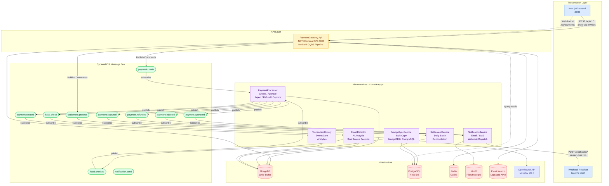
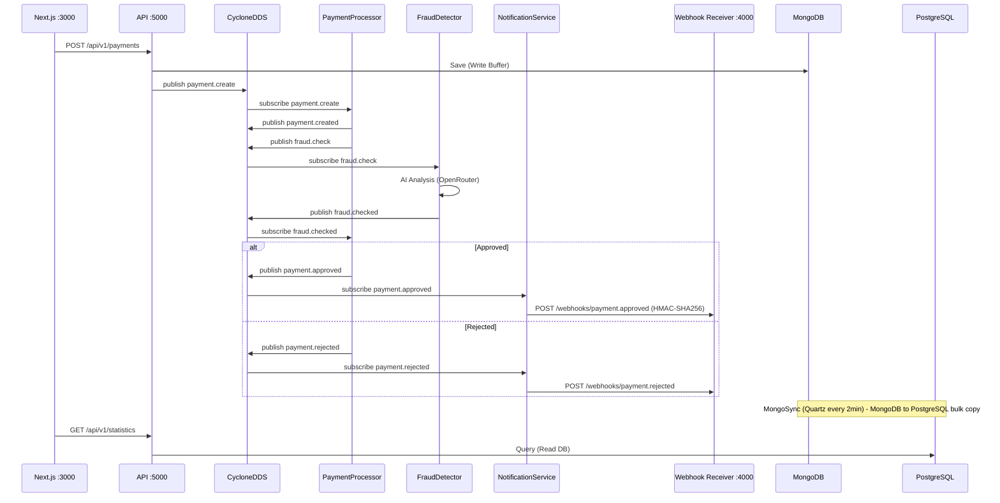
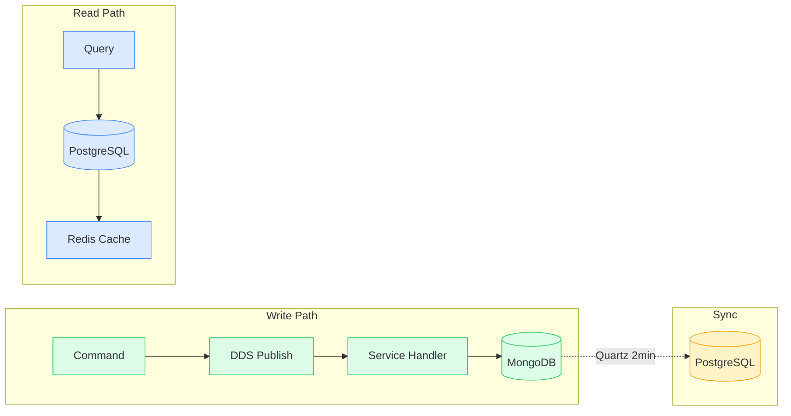
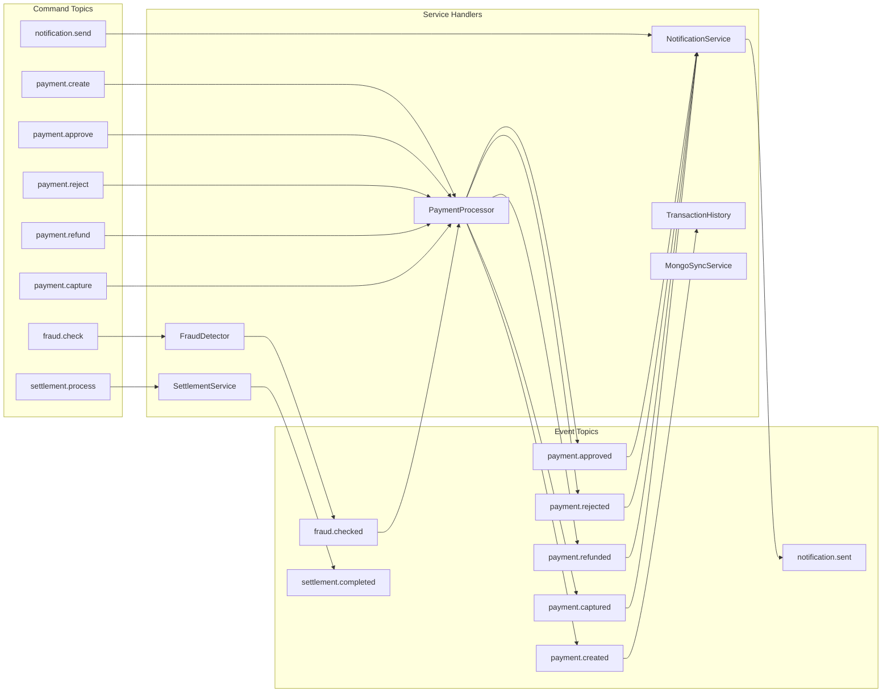
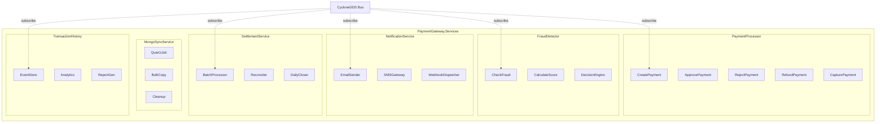
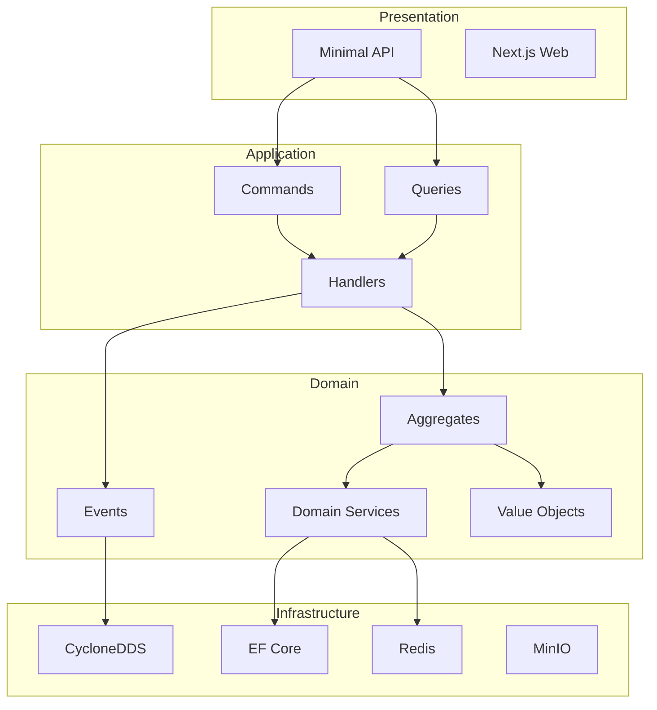
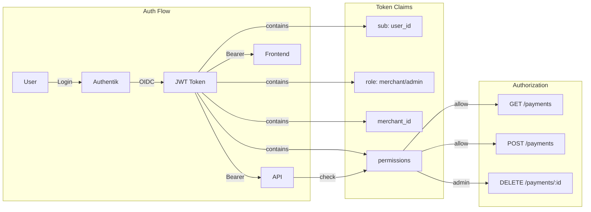
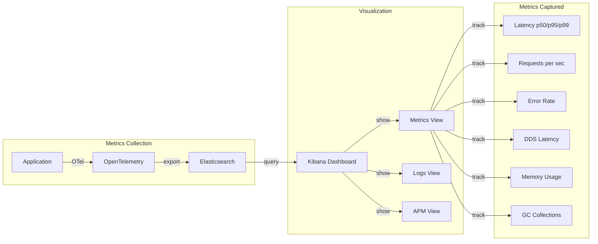

# Payment Gateway - Arquitetura do Sistema v2

> **Versão:** 2.0
> **Data:** 2026-03-18
> **Status:** Implementado

---

## 1. Visão Geral da Arquitetura

---

## 2. Fluxo Principal de um Pagamento

---

## 3. Padrao CQRS - Write vs Read Path

---

## 4. DDS Topics - Commands e Events

---

## 5. Console Apps - SOLID Responsibilities

---

## 6. Clean Architecture Layers

---

## 7. Autenticacao e Autorizacao

---

## 8. Observabilidade

---

## 9. Stack Tecnologico

| Camada | Tecnologia | Finalidade |
|--------|------------|------------|
| Frontend | Next.js 16, TypeScript, Tailwind | Web UI |
| API | .NET 8 Minimal API | REST entry point |
| CQRS | MediatR | Command/Query separation |
| Domain | DDD + Event Sourcing | Business logic |
| Message Broker | CycloneDDS.NET | High-performance pub/sub |
| Write Buffer | MongoDB | High-throughput writes |
| Read DB | PostgreSQL + EF Core | Consolidated reads |
| Cache | Redis | Session + data cache |
| Files | MinIO | Receipts, documents |
| Logs/APM | Elasticsearch + Kibana | Observability |
| AI | OpenRouter (MiniMax M2.5) | Fraud detection |
| Auth | Authentik OIDC | Authentication |
| Scheduler | Quartz.NET | Batch jobs |
| Webhooks | NestJS receiver | Event callbacks |

---

## 10. Portas dos Servicos

| Servico | Porta | Protocolo |
|---------|-------|-----------|
| PaymentGateway.Api | 5000 | HTTP |
| Next.js Frontend | 3000 | HTTP |
| Webhook Receiver | 4000 | HTTP |
| PostgreSQL | 5432 | TCP |
| MongoDB | 27017 | TCP |
| Redis | 30379 | TCP |
| Elasticsearch | 443 | HTTPS |
| MinIO | 443 | HTTPS |

---

## 11. Performance Targets

| Metrica | Target |
|---------|--------|
| RPS (Requests/sec) | 1,000,000+ |
| API Latency p99 | < 50ms |
| DDS Latency | < 5ms |
| Database Write | < 10ms |
| Cache Hit Rate | > 95% |
