# Payment Gateway - Lógica de Negócio

> **Versão:** 2.0
> **Data:** 2026-03-19
> **Status:** Implementado

---

## 1. Diagrama de Classes - Domínio

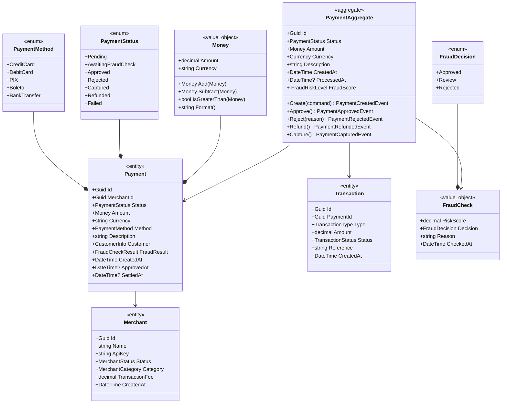

---

## 2. Eventos de Domínio (Event Sourcing)

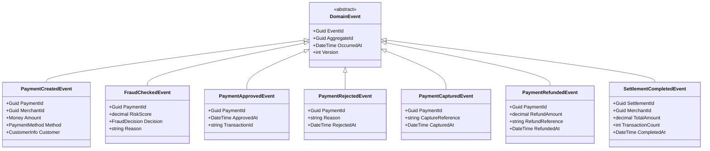

---

## 3. Commands e Queries (CQRS)

```mermaid
classDiagram
    %% Commands
    class ICommand~TResult~ {
        <<interface>>
    }

    class CreatePaymentCommand {
        +Guid MerchantId
        +decimal Amount
        +string Currency
        +PaymentMethod Method
        +CustomerInfo Customer
        +string Description
    }

    class ApprovePaymentCommand {
        +Guid PaymentId
        +string ApproverId
    }

    class RejectPaymentCommand {
        +Guid PaymentId
        +string Reason
    }

    class RefundPaymentCommand {
        +Guid PaymentId
        +decimal? Amount
        +string Reason
    }

    class CapturePaymentCommand {
        +Guid PaymentId
    }

    class CheckFraudCommand {
        +Guid PaymentId
        +CustomerInfo Customer
        +Money Amount
    }

    %% Queries
    class IQuery~TResult~ {
        <<interface>>
    }

    class GetPaymentByIdQuery {
        +Guid PaymentId
    }

    class GetPaymentsByMerchantQuery {
        +Guid MerchantId
        +DateTime? From
        +DateTime? To
        +PaymentStatus? Status
    }

    class GetPaymentStatisticsQuery {
        +Guid MerchantId
        +DateTime From
        +DateTime To
    }

    ICommand <|-- CreatePaymentCommand
    ICommand <|-- ApprovePaymentCommand
    ICommand <|-- RejectPaymentCommand
    ICommand <|-- RefundPaymentCommand
    ICommand <|-- CapturePaymentCommand
    ICommand <|-- CheckFraudCommand

    IQuery <|-- GetPaymentByIdQuery
    IQuery <|-- GetPaymentsByMerchantQuery
    IQuery <|-- GetPaymentStatisticsQuery
```

---

## 4. Handlers

```mermaid
classDiagram
    %% Command Handlers
    class ICommandHandler~TCommand, TResult~ {
        <<interface>>
        +Handle(TCommand command)
    }

    class CreatePaymentHandler {
        +Handle(CreatePaymentCommand) CommandResult
    }

    class ApprovePaymentHandler {
        +Handle(ApprovePaymentCommand) CommandResult
    }

    class FraudCheckHandler {
        +Handle(CheckFraudCommand) FraudResult
    }

    class RefundPaymentHandler {
        +Handle(RefundPaymentCommand) CommandResult
    }

    %% Query Handlers
    class IQueryHandler~TQuery, TResult~ {
        <<interface>>
        +Handle(TQuery query)
    }

    class GetPaymentByIdHandler {
        +Handle(GetPaymentByIdQuery) PaymentDto
    }

    class GetPaymentsByMerchantHandler {
        +Handle(GetPaymentsByMerchantQuery) PaymentListDto
    }

    class GetStatisticsHandler {
        +Handle(GetPaymentStatisticsQuery) StatisticsDto
    }

    ICommandHandler <|-- CreatePaymentHandler
    ICommandHandler <|-- ApprovePaymentHandler
    ICommandHandler <|-- FraudCheckHandler
    ICommandHandler <|-- RefundPaymentHandler

    IQueryHandler <|-- GetPaymentByIdHandler
    IQueryHandler <|-- GetPaymentsByMerchantHandler
    IQueryHandler <|-- GetStatisticsHandler
```

---

## 5. Domain Services

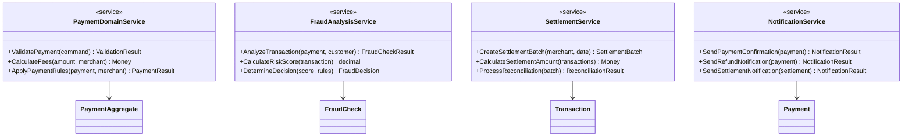

---

## 6. Infrastructure - Persistência

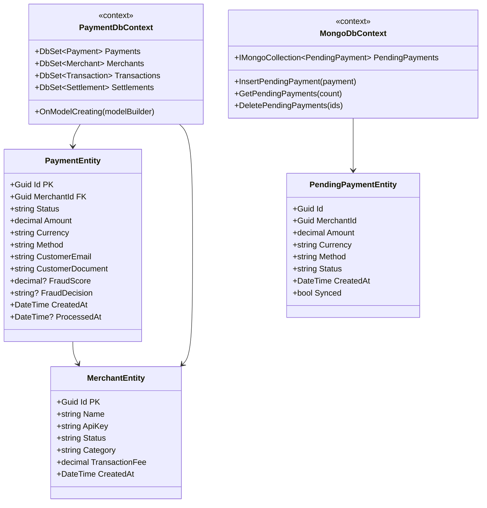

---

## 7. Redis Cache

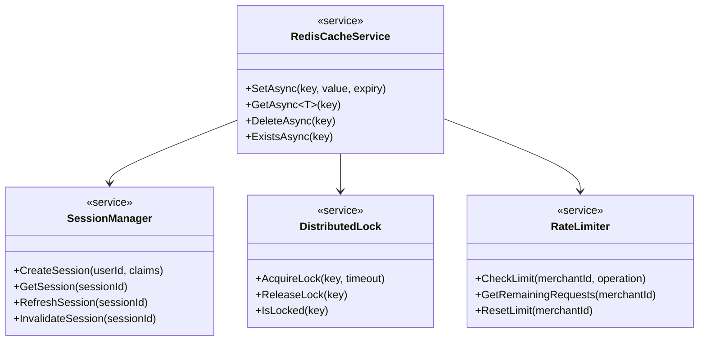

---

## 8. DDS Topics - Contratos

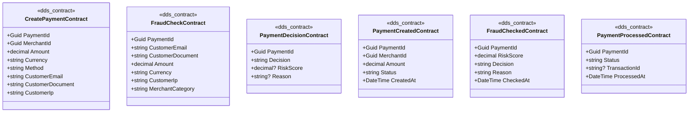

---

## 9. Detecção de Fraude (AI)

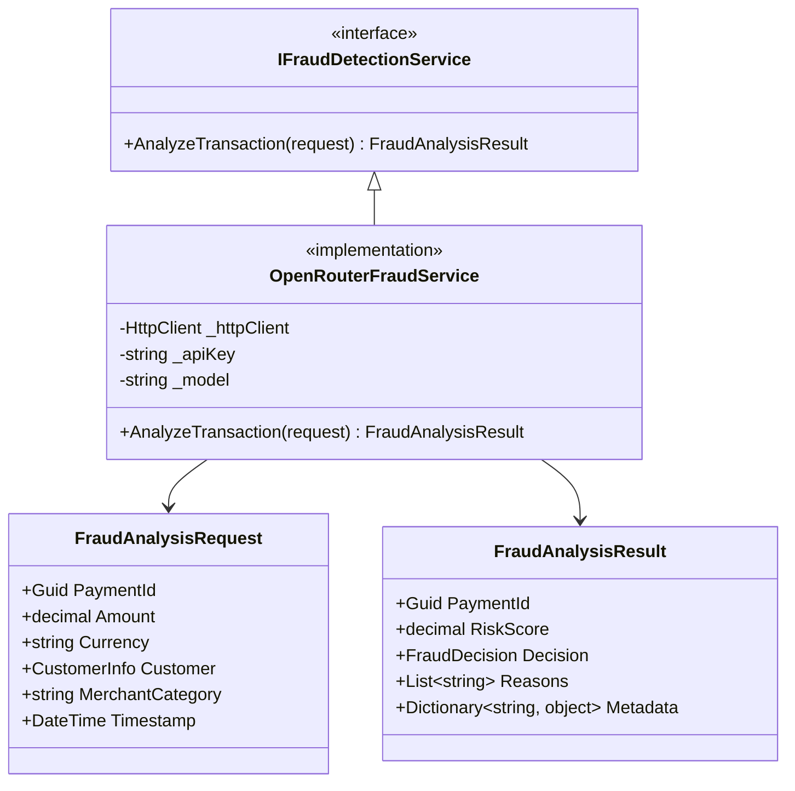

---

## 10. Fluxo de Estados (State Machine)

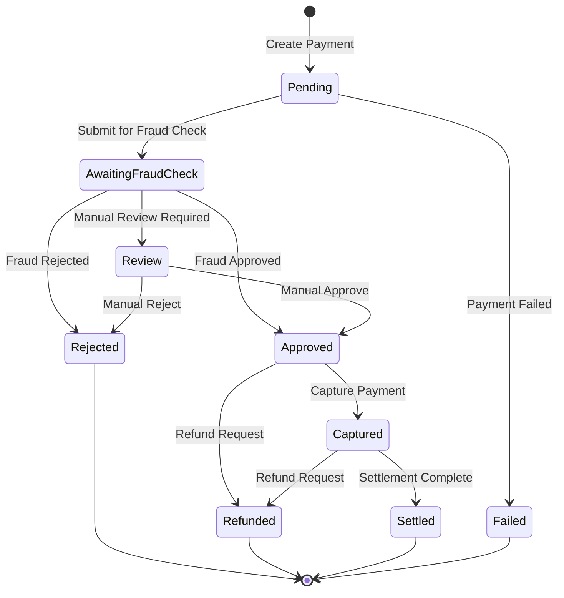

---

## 11. Regras de Negócio

### 11.1 Criação de Pagamento

```csharp
// Regras de negócio para criação
1. Merchant deve estar ativo
2. Amount deve ser > 0
3. Amount não deve exceder limite do merchant
4. Currency deve ser suportada
5. Customer deve ter email válido
6. Método de pagamento deve estar disponível para o merchant
```

### 11.2 Análise de Fraude

```csharp
// Regras de scoring de fraude
- Score < 30: Aprovado automaticamente
- Score 30-70: Revisão manual
- Score > 70: Rejeitado automaticamente
- Score > 50 com amount > 10000: Revisão manual obrigatória
```

### 11.3 Taxas e Comissão

```csharp
// Cálculo de taxas
Fee = TransactionAmount * Merchant.FeePercentage
NetAmount = TransactionAmount - Fee
SettlementAmount = Sum(NetAmount) - SettlementFee
```

---

## 12. DTOs

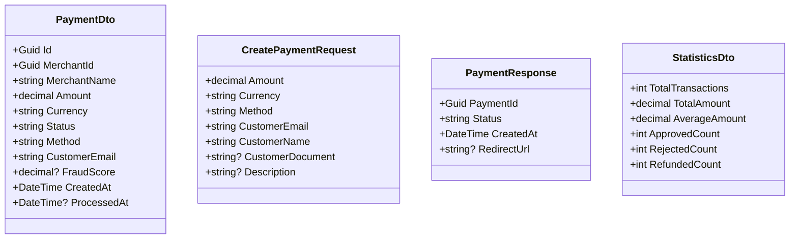
