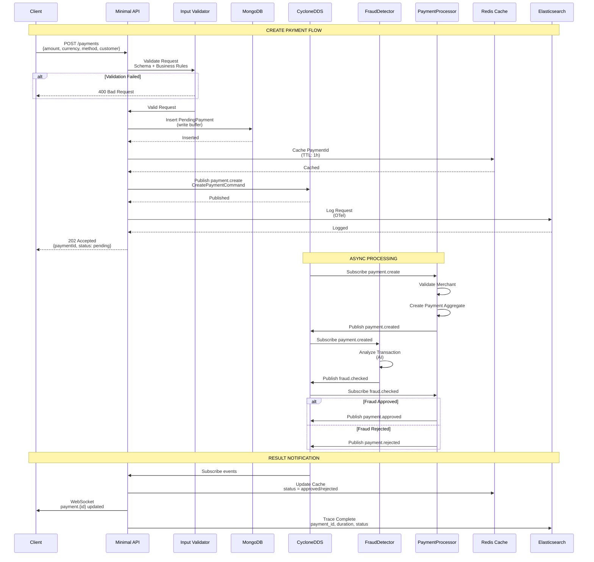
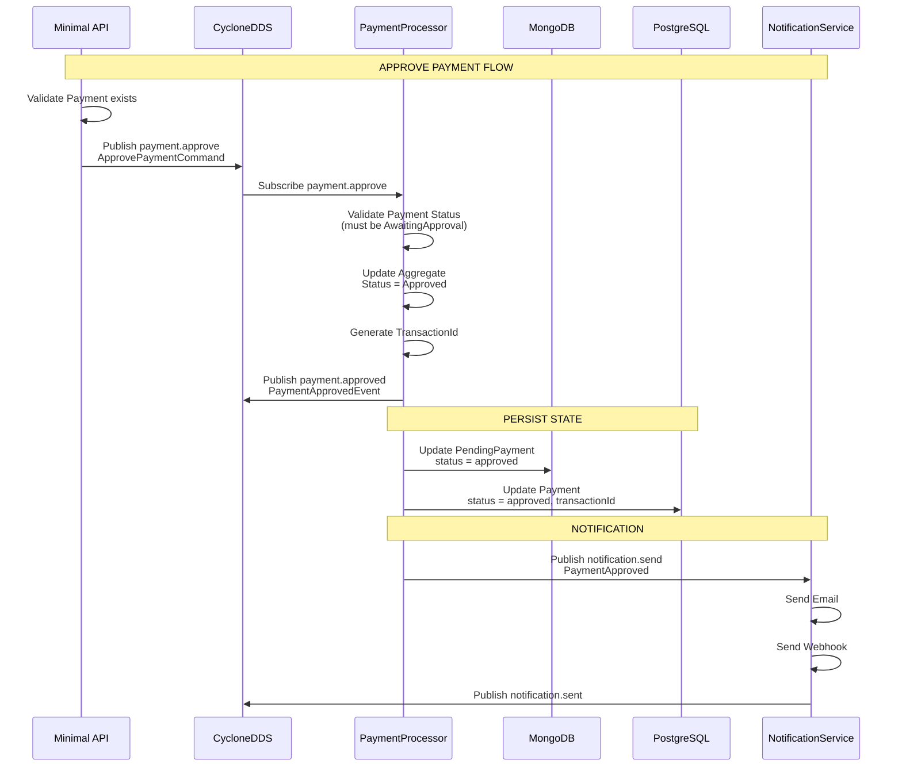
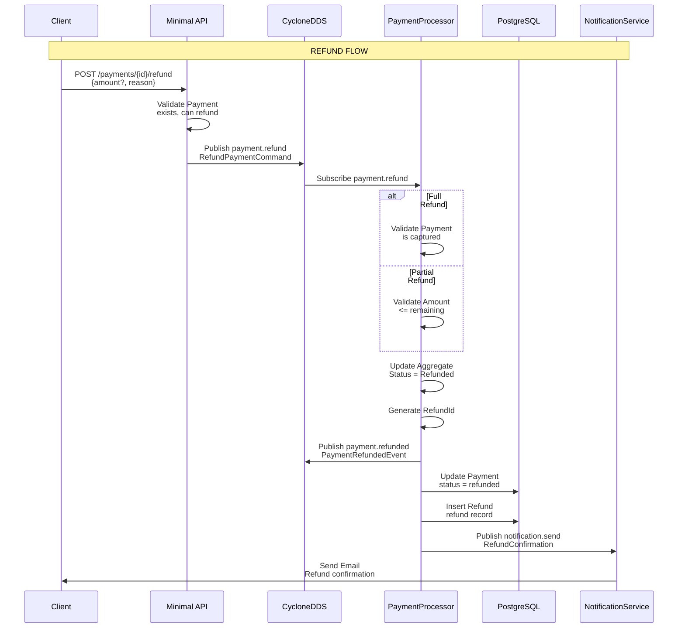
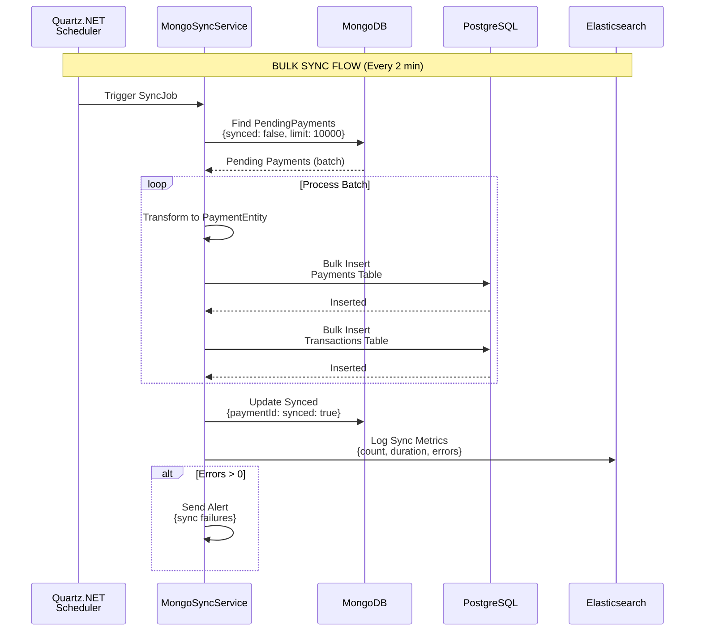
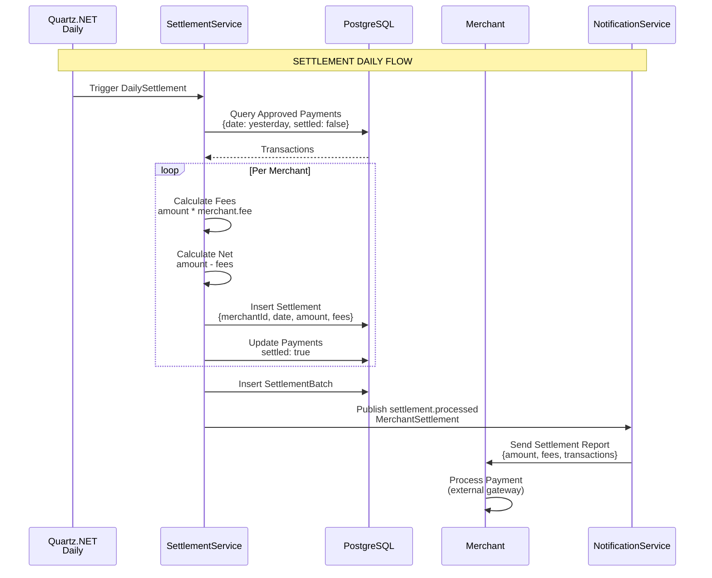
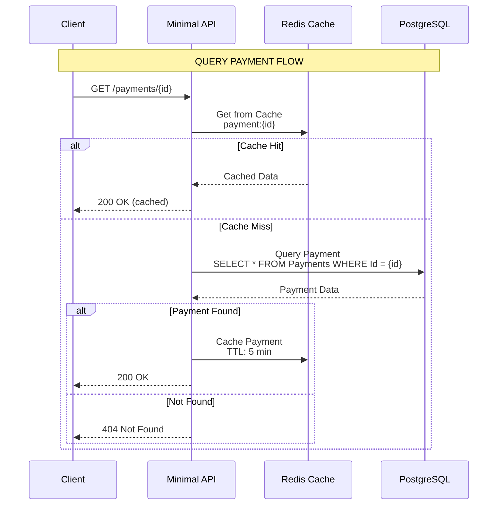
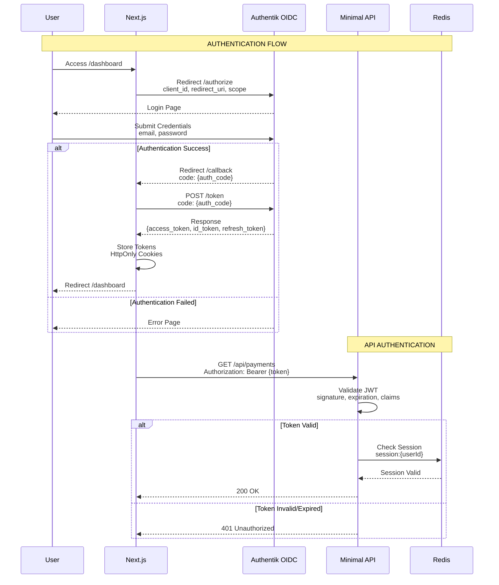
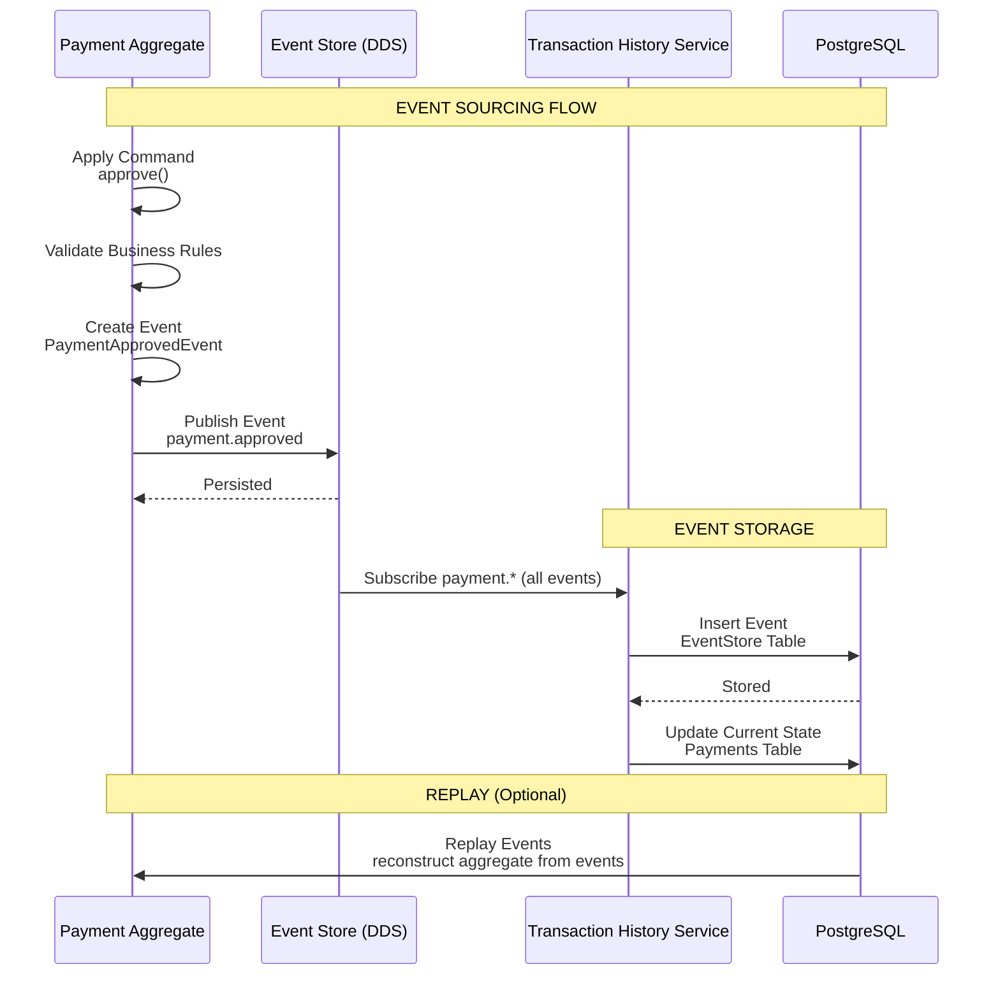
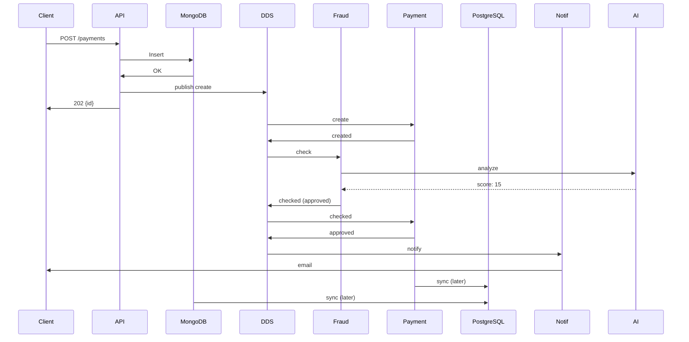

# Payment Gateway - CQRS e Fluxo de Eventos

> **Versão:** 2.0
> **Data:** 2026-03-19
> **Status:** Implementado

---

## 1. Fluxo de Criação de Pagamento



---

## 2. Fluxo de Aprovação de Pagamento



---

## 3. Fluxo de Verificação de Fraude

```mermaid
sequenceDiagram
    participant Payment as PaymentProcessor
    participant DDS as CycloneDDS
    participant Fraud as FraudDetector
    participant AI as OpenRouter<br/>MiniMax M2.5
    participant Redis as Redis Cache

    Note over Payment,Redis: FRAUD CHECK FLOW

    Payment->>DDS: Publish fraud.check<br/>FraudCheckCommand

    DDS->>Fraud: Subscribe fraud.check
    Fraud->>Redis: Check Merchant<br/>fraud config
    Redis-->>Fraud: Config

    Fraud->>AI: POST /v1/chat/completions<br/>Analyze transaction
    rect rgb(240, 248, 255)
        Note over AI,Fraud: FRAUD ANALYSIS PROMPT
        AI<<--System: You are a fraud detection analyst...
        AI<<--User: Analyze this transaction:
        AI<<--User: - Amount: $500
        AI<<--User: - Customer: john@email.com
        AI<<--User: - IP: 192.168.1.1
        AI<<--User: - Merchant: online_store
    end

    AI-->>Fraud: Response<br/>{score: 25, decision: approved, reasons: []}

    alt Risk Score < 30
        Fraud->>DDS: Publish fraud.checked<br/>Decision: Approved
    else Risk Score 30-70
        Fraud->>DDS: Publish fraud.checked<br/>Decision: Review
    else Risk Score > 70
        Fraud->>DDS: Publish fraud.checked<br/>Decision: Rejected
    end

    Fraud->>Redis: Cache fraud result<br/>(merchant + customer)
```

---

## 4. Fluxo de Reembolso



---

## 5. Fluxo de Sync MongoDB → PostgreSQL



---

## 6. Fluxo de Liquidação (Settlement)



---

## 7. Consulta de Pagamento (Read)



---

## 8. Fluxo de Autenticação



---

## 9. Event Sourcing - Stored Events



---

## 10. Fluxo Completo - happy path



---

## 11. Tabela de Eventos

| Evento | Producer | Consumer | Payload |
|--------|----------|----------|---------|
| `payment.create` | API | PaymentProcessor | CreatePaymentCommand |
| `payment.created` | PaymentProcessor | FraudDetector, History | PaymentCreatedEvent |
| `fraud.check` | PaymentProcessor | FraudDetector | FraudCheckCommand |
| `fraud.checked` | FraudDetector | PaymentProcessor | FraudCheckedEvent |
| `payment.approved` | PaymentProcessor | NotificationService, History | PaymentApprovedEvent |
| `payment.rejected` | PaymentProcessor | NotificationService, History | PaymentRejectedEvent |
| `payment.capture` | API | PaymentProcessor | CaptureCommand |
| `payment.captured` | PaymentProcessor | SettlementService | PaymentCapturedEvent |
| `payment.refund` | API | PaymentProcessor | RefundCommand |
| `payment.refunded` | PaymentProcessor | NotificationService, History | PaymentRefundedEvent |
| `settlement.process` | Quartz | SettlementService | SettlementCommand |
| `notification.send` | Multiple | NotificationService | NotificationCommand |
